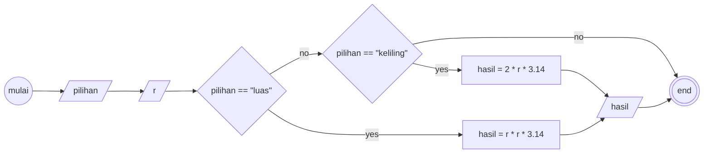

```mermaid

flowchart LR
    Start((mulai))
    R[/r/]
    Pilihan[/pilihan/]
    CekPilihanLuas{"pilihan == #quot;luas#quot;"}
    CekPilihanKeliling{"pilihan == #quot;keliling#quot;"}
    HitungLuas[hasil = r * r * 3.14]
    HitungKeliling[hasil = 2 * r * 3.14]
    CetakHasil[/hasil/]
    End(((end)))

    Start --> Pilihan
    Pilihan --> R
    R --> CekPilihanLuas
    CekPilihanLuas --> |yes| HitungLuas
    CekPilihanLuas --> |no| CekPilihanKeliling
    CekPilihanKeliling --> |yes| HitungKeliling
    CekPilihanKeliling --> |no| End
    HitungKeliling --> CetakHasil
    HitungLuas --> CetakHasil
    CetakHasil --> End
    
```
